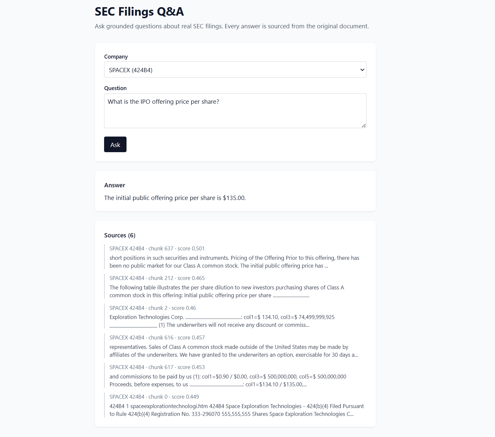

# SEC Filings RAG

Ask grounded questions about real SEC filings. Every answer cites the passage it came from.

**Live demo:** https://sec-filings-rag.vercel.app




## How it works

Offline, once per filing: fetch from EDGAR → linearize tables → chunk → embed → save.

At request time: embed the question → cosine search the index → pass top chunks to the LLM with a "refuse rather than hallucinate" prompt → return answer + sources.

## Evaluation

The system is measured against a 35-question hand-labeled benchmark spanning four
categories, including deliberately unanswerable questions to detect hallucination.

| Category | Answer accuracy | Retrieval hit rate |
|---|---|---|
| Exact figure | 84% (16/19) | 79% |
| Synthesis | 100% (5/5) | 100% |
| Cross-company | 67% (4/6) | 100% |
| Unanswerable | 100% (5/5) | — |
| **Overall** | **86% (29/35)** | |

**Hallucination rate: 0%.** On all five unanswerable questions the system correctly
declined rather than inventing an answer.

Run it yourself: `python -m eval.run`

## Decisions worth noting

- **Tables get linearized before chunking.** Naive HTML extraction scatters numbers away from their labels; rewriting rows as `label: header=value` keeps them attached.
- **The company name is stripped from the retrieval query.** Counter-intuitive, but in a corpus where every chunk is about SpaceX, "SpaceX" is a zero-information token that dilutes the query embedding — and it collided with a segment name, retrieving segment revenue instead of consolidated. The name is kept in the generation prompt, where the LLM does need it. Retriever and generator have opposite needs.
- **The judge is category-aware.** A single grading rubric applied exact-figure strictness to open-ended synthesis questions, marking correct answers wrong. Separate rubrics per category fixed it.
- **`temperature=0` and an explicit refusal prompt.** Grounded QA needs faithfulness, not creativity. The model says "I couldn't find that" instead of guessing.
- **Per-chunk metadata** (`company`, `filing_type`, `chunk_index`) is what makes source citation and per-company filtering work.
- **The vector store ships with the deploy.** ~5MB committed to git. At larger scale this moves to S3.

## What the eval caught

The first eval run reported **31% accuracy**, which contradicted manual spot-checks.
I hand-graded all 35 items and compared. The gap decomposed into two distinct bugs:

1. **Query dilution.** Including the company name in the query degraded retrieval,
   because in a single-company corpus the name carries no discriminating signal but
   still consumes the embedding. `"SpaceX revenue growth"` retrieved the space-segment
   figure; `"revenue growth"` retrieved the correct consolidated one.
2. **An over-strict judge.** The rubric penalized synthesis answers for omitting
   details that weren't required, marking six correct answers as wrong.

Fixing both took accuracy from 31% to 83%. The lesson: the measurement instrument
needs measuring before you trust what it tells you.

## Stack

Python, FastAPI, NumPy, BeautifulSoup, React, Vite, Tailwind. OpenAI for embeddings and generation. Vercel + Fly.io for deploy.

## Run locally

```bash
# Backend
python -m venv .venv && source .venv/bin/activate
pip install -r requirements.txt
cp .env.example .env  # add your OpenAI key
uvicorn api:app --reload

# Frontend (separate terminal)
cd frontend && npm install && npm run dev
```

Indexed companies: SpaceX, Apple, NVIDIA, Tesla, JPMorgan. Add another:

```bash
python fetch.py MSFT 10-K
python ingest.py
```

## Known limitations

- **Cross-company questions split the retrieval budget.** With `k=6` across five
  filings, a question comparing two companies may retrieve enough context for one
  and not the other. Per-company retrieval with merged context is the fix.
- **Tabular fact extraction is the weakest path.** Narrative chunks retrieve well
  for narrative questions; tables embed weakly against natural-language queries even
  after linearization. This is RAG's open problem with structured data.
- **Pre-indexed, not on-demand.** Arbitrary tickers require a re-index.

## Next

Hybrid dense + sparse (BM25) retrieval to fix exact-term matching. Per-company
retrieval for cross-company questions. Hybrid caching for arbitrary tickers.
pgvector instead of NumPy. Streaming responses.

